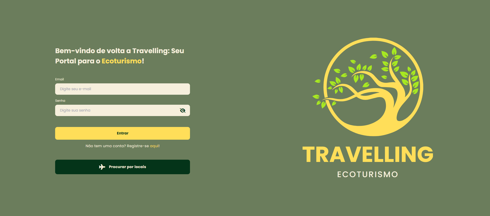

<h1 align="center">🌎 Travelling</h1>
<p align="center">
  <em>A project for planning trips, discovering attractions and connecting agencies, tourists and companies.</em>
</p>

---

## 📑 About the Project
Travelling is a **Full Stack** app that connects travelers to local experiences.
The main idea would be to centralize all the necessary information so that anyone could plan an ecotourism trip, selecting attractions, events, restaurants and hotels, creating and living a story with their choices.
The backend was developed in **NestJS + ORM Prisma + PostgreSQL** and the frontend in **React + TypeScript + Vite**.

---

## 🏗 Project Structure

travelling/

├── backend/ # API

├── frontend/ # Interface

└── docs/ # Prints

---

## 🚀 How to Run the Project

### 1️⃣ Clonar o Repositório
```bash
git clone git@github.com:VitorSousaS/travelling.git
cd travelling
```
### 2️⃣ Backend (NestJS)

```bash
cd backend
cp .env.example .env
# the projects uses JWT and Google Cloud services for storage, if don't defined will not load images from the registers
# an example of what will be needed:
# NODE_ENV="production"
# DATABASE_URL: configure your bank in .env
# JWT_SECRET= any secret
# PROJECT_ID: project id in google cloud services
# PRIVATE_KEY: private key from googlecloud bucket
# CLIENT_EMAIL: client email to access googlecloud bucket
# STORAGE_MEDIA_BUCKET: bucket name
npm install
npx prisma migrate dev
npm run start:dev
```
Access an API at: http://localhost:3333

Swagger Documentation: http://localhost:3333/docs

### 3️⃣ Frontend
cd ../frontend
npm install
npm run dev

Access the front at: http://localhost:3000

<p align="center">    </p>


## 🛠 Technologies

Backend: NestJS, ORM Prisma, PostgreSQL

Frontend: React, TypeScript, Vite
